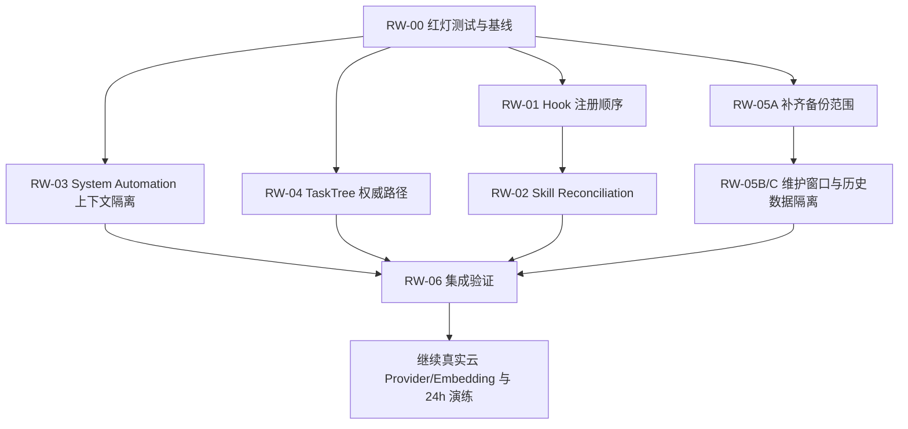

# OneManCompany 历史员工、Skill Hook 与系统自动化告警专项修复计划

> 版本：1.0
> 日期：2026-08-14
> 状态：✅ 已完成（2026-08-14）；不代表正式 24 小时上线
> 适用范围：单机 SQLite、TaskTree standard v2、正式员工 00001—00012
> 上位文档：`IMPLEMENTATION-PLAN.md`、`ADR-001-sqlite-runtime.md`、`STATUS-REPORT.md`

## 执行结果摘要

- RW-00—RW-06 已完成；专项测试与全量回归均通过。
- 正式员工 `00002`—`00005` 已完成 audited dry-run + apply skill reconciliation；`session-logger.sh` 已补齐，员工定制冲突均保留。
- 历史无效 `ex-employees/00010`、`ex-employees/00100` 已在 644-file 校验备份和独立恢复验证后移动到唯一 quarantine 目录。
- system automation context 与 automation/adhoc TaskTree 权威路径修复已完成。
- 受控真实服务验证通过：`PASS=35 FAIL=0 WARN=0`，目标假告警未复现，服务干净关闭。
- 正式 `employees/00010/profile.yaml` 和受保护 `iter_009.yaml` 在本专项操作前后文件 SHA-256 保持不变。
- 详细证据：`reports/RUNTIME-WARNING-REMEDIATION-20260814.md`。

> 后续仍需单独处理正式 RuntimeStorage 中观测到的 `checkpoint_conflicts=7` 与 `memory_worker_backlog=25`，并继续真实 Provider、embedding/vector、24 小时墙钟和最终 standard v2 验收；不得把本专项完成解释为 `formal_24h_launch_allowed=true`。

---

## 1. 目标

本专项处理当前运行日志中的三类问题，并同时修复与 automation/adhoc TaskTree 定位相关的伴随缺陷：

1. 历史 `ex-employees` 中存在不安全 YAML 标签、不完整 profile 和与在职员工重复的历史 ID；
2. 已安装员工 skill 缺少 `session-logger.sh`，而 `ask_first` 类型的 `create-pr` 被错误解析并产生假告警；
3. `_sys_automation_*` TaskTree 被误当成普通 named project 查询，产生 `project not found in store` 假告警；
4. `tree_tools` 使用普通项目目录猜测 TaskTree 路径，并使用错误的 Loguru `%s` 占位符。

专项完成后，应达到以下结果：

- 历史异常数据被完整备份、保留哈希和审计后隔离，不删除、不伪造、不重新纳入正式员工；
- 自动 hook 可用，`ask_first` hook 不解析、不注册、不产生缺失脚本告警；
- 默认 skill 更新能够受控同步到既有员工，且不覆盖员工自定义文件；
- 系统 automation 保留 TaskTree、checkpoint、receipt 和日志，但不进入普通项目历史、产品或长期记忆上下文；
- standard v2 工具始终从任务条目中的权威 `tree_path` 加载 TaskTree，找不到时 fail closed；
- 修复不触碰、不迁移、不恢复 `iter_009`。

---

## 2. 当前事实基线

### 2.1 历史员工

当前异常运行文件：

```text
.onemancompany/company/human_resource/ex-employees/00010/profile.yaml
.onemancompany/company/human_resource/ex-employees/00100/profile.yaml
```

已确认：

- `ex-employees/00010/profile.yaml` 使用 `!!python/tuple`，无法通过 `yaml.safe_load()`；
- 正式员工目录中同时存在在职 `employees/00010`，不得覆盖、移动或修改该正式员工；
- `ex-employees/00100/profile.yaml` 缺少 `name`、`role`、`skills`；
- 已存在 `quarantine-employees/00100-legacy-20260813/`，但其 profile 哈希与当前 `ex-employees/00100/profile.yaml` 不同，不能相互覆盖；
- `.onemancompany/` 被 Git 忽略，Git commit 不能代替运行数据备份和维护审计。

当前加载器 `load_validated_employee_profile()` 会安全跳过非法 profile，所以正式员工不会被这些记录直接替换；问题主要是历史数据不一致和重复告警。

### 2.2 Skill Hook

默认源码包含：

```text
src/onemancompany/default_skills/self-improving-agent/hooks/session-logger.sh
```

员工 `00002`—`00005` 已安装的 `self-improving-agent/hooks/` 均缺少：

```text
session-logger.sh
```

默认源码本来就不存在：

```text
create-pr.sh
```

而 `SKILL.md` 将 `create-pr` 声明为：

```yaml
mode: ask_first
```

当前 `register_skill_hooks()` 在判断 `ask_first` 之前调用 `_resolve_trigger()`，因此产生不应出现的缺失脚本告警。

### 2.3 系统自动化项目

系统 automation 会创建真实 TaskTree，例如：

```text
project_id: _sys_automation_coo-auto-schedule
```

TaskTree 存放于员工任务目录：

```text
.onemancompany/company/human_resource/employees/{employee_id}/tasks/{node_id}_tree.yaml
```

这类 TaskTree 是正式的执行恢复数据，但不是普通 named project。当前 Prompt 构造路径对所有非空 `project_id` 加载项目 identity、product、history 和 workflow context，导致 `_sys_automation_*` 被错误查询。

### 2.4 TaskTree 定位

`tree_tools._load_tree(project_dir)` 当前固定查询：

```text
{project_dir}/task_tree.yaml
```

automation/adhoc TaskTree 不采用该布局。与此同时，缺失日志使用 `%s`，Loguru 不会替换为真实路径。

### 2.5 备份缺口

当前 `docs/automation/backup-scripts/backup-all.sh` 只归档：

```text
company/human_resource/employees/
```

尚未纳入：

```text
company/human_resource/ex-employees/
company/human_resource/quarantine-employees/
```

因此不得在补齐备份范围前移动历史员工数据。

---

## 3. 不可破坏的约束

1. TaskTree、dispatch/executor receipt 和 acceptance audit 继续作为正式业务权威；告警修复不能从长期记忆或日志推断正式状态。
2. 不修改、迁移、恢复或重新执行 `iter_009`。
3. 不直接删除 `ex-employees/00010`、`ex-employees/00100` 或既有 quarantine 内容。
4. 不将历史 `00010` 写回或合并到正式 `employees/00010`。
5. 不根据猜测为 `00100` 补写 `name`、`role` 或 `skills`。
6. 不创建虚假的 `_sys_automation_*` named project 来消除告警。
7. 不创建无业务定义的 `create-pr.sh` 来掩盖 resolver 顺序缺陷。
8. 不允许 skill reconciliation 覆盖员工新增的私有文件；覆盖默认拥有文件时必须有明确的版本和哈希策略。
9. standard v2 找不到权威 TaskTree 时必须 holding/fail closed，不能返回空树继续执行。
10. 所有运行数据移动必须具备变更前快照、SHA-256、append-only audit 和可执行回滚步骤。

---

## 4. 实施工作包

## RW-00：建立红灯测试和维护基线

### 目标

在修改实现前建立能够捕获四类具体症状的快速、确定性测试。

### 实施

1. 在 `tests/unit/core/test_skill_hooks.py` 增加回归测试：
   - `mode=ask_first` 时不得调用 `_resolve_trigger()`；
   - 不注册 hook；
   - 不输出 missing trigger warning；
   - `mode=auto` 且脚本缺失时仍然告警。
2. 为既有员工 skill 同步增加临时目录测试：
   - dry-run 只报告缺失文件；
   - execute 只复制缺失的默认文件；
   - 已存在的员工自定义文件不被覆盖；
   - 重复执行结果为零差异。
3. 在 vessel 相关单元测试中增加 `_sys_automation_*` 场景：
   - 不调用 `load_named_project()`；
   - 不调用普通项目 history/product/workflow 构造器；
   - 仍保留 TaskTree 和 automation 本身的执行上下文。
4. 在 `tree_tools` 测试中增加 automation/adhoc `entry.tree_path` 场景：
   - 使用权威路径加载；
   - standard v2 权威路径缺失时 fail closed；
   - 日志包含实际路径，不包含字面量 `%s`。
5. 为历史员工维护流程增加文件系统测试：
   - 相同 ID 不覆盖既有 quarantine；
   - 每个移动记录包含源路径、目标路径、大小和 SHA-256；
   - 中途失败时原始文件保持存在或事务回滚。

### 验收

- 修改前，至少一个测试能够稳定复现每个实际问题；
- 测试不读取或修改正式 `.onemancompany` 数据；
- 所有测试使用 `tmp_path` 或独立 `OMC_DATA_ROOT`。

---

## RW-01：修复 Skill Hook 注册顺序

### 修改范围

```text
src/onemancompany/core/skill_hooks.py
tests/unit/core/test_skill_hooks.py
```

### 实施

1. 在解析 `command` 或 `trigger` 之前读取并规范化 `mode`；
2. `mode == "ask_first"` 时立即跳过；
3. 只有可自动执行的 hook 才调用 `_resolve_trigger()`；
4. 保留 `auto` hook 缺失脚本时的告警，不降低安全检查；
5. 嵌套 hook 和扁平 hook 使用相同的模式处理规则；
6. 不新增 `create-pr.sh`。

### 验收

- `create-pr + ask_first`：注册数为 0，resolver 调用数为 0，无 missing-script warning；
- `session-logger + auto` 且脚本存在：正常注册；
- `auto` 且脚本缺失：仍产生可定位告警；
- 既有 pre-tool、post-bash 和 session-end 测试不回归。

### 回滚

仅回滚本代码提交，不需要修改运行数据。回滚后会恢复假告警，但不会破坏 TaskTree 或员工 profile。

---

## RW-02：实现受控默认 Skill Reconciliation

### 修改范围

优先复用：

```text
src/onemancompany/agents/onboarding.py::_inject_default_skills
```

并在受控管理层提供 dry-run/execute 入口；具体入口可以是管理 API + `onemancompany-admin`，不得依靠手工批量 `cp` 作为长期机制。

### 实施

1. 抽取可测试的 reconciliation service，输入：employee ID、skill name、dry-run；
2. 生成逐文件计划：
   - `missing_default_file`：允许复制；
   - `same_hash`：跳过；
   - `employee_only_file`：保留；
   - `default_owned_changed`：默认不覆盖，进入 conflict；
3. 使用临时文件、`fsync` 和原子替换写入缺失文件；
4. 保存 reconciliation audit：
   - employee ID；
   - skill name；
   - source/target path；
   - source/target SHA-256；
   - action；
   - operator；
   - timestamp；
5. 先对 `00002`—`00005` dry-run；预期只补齐 `session-logger.sh`；
6. 执行后重新注册 hook，并再次 dry-run 验证幂等；
7. 后续 onboarding 和升级流程共用同一 service，避免实现两套复制规则。

### 验收

- `00002`—`00005` 均存在 `session-logger.sh`；
- 文件哈希与默认源一致；
- 员工自定义文件未被修改；
- 第二次执行不产生新写入；
- 服务重启后 `session-logger` 自动 hook 注册成功；
- `create-pr` 仍无脚本，但不再告警。

### 回滚

依据 audit 删除本次新增且哈希仍与源一致的文件；如果文件在同步后被修改，则禁止自动删除，进入人工冲突处理。

---

## RW-03：隔离系统 Automation 与普通项目上下文

### 修改范围

```text
src/onemancompany/core/vessel.py
src/onemancompany/core/task_lifecycle.py
相关 vessel/automation 单元测试
```

### 实施

1. 在 Agent Prompt 构造入口统一判断 `is_system_project_id(project_id)`；
2. 对 `_sys_*` 和 `_auto_*` 跳过：
   - named project identity；
   - named project metadata；
   - product context；
   - product workspace context；
   - project history context；
   - 普通 project workflow context；
3. 不删除或改写系统 TaskTree 的 `project_id`；
4. 保留：
   - TaskTree 当前节点、父子节点和依赖上下文；
   - checkpoint thread；
   - execution checkpoint；
   - task index；
   - dispatch/executor receipt；
   - automation registration/trigger receipt；
5. 如果 automation Agent 需要额外上下文，新增明确的 system automation context builder，只读取 automation manifest、registration receipt 和当前 TaskTree；
6. 长期记忆检索层同样拒绝把 `_sys_automation_*` 当作普通项目 namespace。系统 automation 的经验写入员工 episodic 或专用 system scope，不污染业务项目事实。

### 验收

- `_sys_automation_coo-auto-schedule` 不再出现 `project not found in store`；
- mock 证明 `load_named_project()` 未被调用；
- 普通项目和 iteration 仍能加载 identity、product、history 和 workflow；
- automation TaskTree、checkpoint 和 receipt 数量不减少；
- 重启后 automation 仍通过相同 TaskTree/thread 恢复；
- 不新增任何 `_sys_automation_*` named project 文件。

### 回滚

回滚 Prompt 分类代码即可。系统 TaskTree 数据格式不变，不需要迁移。

---

## RW-04：修复 TaskTree 权威路径和告警可观察性

### 修改范围

```text
src/onemancompany/agents/tree_tools.py
相关 tree tool、dispatch 和 adhoc 测试
```

### 实施

1. 将 Loguru 日志从：

```python
logger.warning("task_tree.yaml not found at %s", path)
```

改为 `{}` 占位符；
2. 不再仅依赖 `project_dir/task_tree.yaml`；
3. 对已经拥有 `task_id` 的正式工具调用，优先通过 `_find_entry_for_task()` 或等价 task registry 查询权威 `entry.tree_path`；
4. 将 `_load_tree()` 和 `_save_tree()` 改造为接收明确 `tree_path`，避免加载和保存使用不同路径；
5. standard v2：
   - `tree_path` 不存在、无法解析或 node 不存在时返回结构化错误；
   - 节点进入 holding/reconciliation required；
   - 禁止返回 `TaskTree(project_id="")` 后继续产生副作用；
6. legacy/adhoc：允许明确标记的兼容返回，但必须携带 `memory_mode/workflow_mode=legacy_degraded` 或等价字段；
7. dispatch、accept 和 reject 必须保存回同一个权威 tree 文件。

### 验收

- automation/adhoc 能从 `employees/{id}/tasks/{node}_tree.yaml` 加载；
- standard v2 缺树测试证明没有派发、验收或其他副作用；
- 日志显示真实绝对路径；
- 普通业务项目现有 dispatch/accept/reject 测试全部通过；
- TaskTree、task index 和 receipt 对账一致。

### 回滚

代码回滚后不迁移 TaskTree；本工作包不得改变现有 TaskTree 文件格式。

---

## RW-05：补齐备份范围并治理历史 Ex-employee

### 修改范围

```text
docs/automation/backup-scripts/backup-all.sh
docs/automation/backup-scripts/restore.sh
历史数据维护脚本或管理命令
.onemancompany/company/human_resource/ex-employees/       # 运行数据，不提交 Git
.onemancompany/company/human_resource/quarantine-employees/ # 运行数据，不提交 Git
```

### 阶段 A：先修备份

1. 将以下目录纳入同一 filesystem backup set：
   - `employees/`；
   - `ex-employees/`；
   - `quarantine-employees/`；
   - 必需的人力资源索引/审计文件；
2. manifest 记录每个 archive 的文件数量、SHA-256、创建时间和 `backup_set_id`；
3. restore 默认恢复到独立 `OMC_DATA_ROOT` 做验证，不直接覆盖正式目录；
4. 增加 tar 内容检查，证明 ex/quarantine 都被包含；
5. 执行一次隔离恢复并重新计算哈希。

### 阶段 B：维护窗口

1. 停止接收新任务并等待 HR/automation 文件写入完成；
2. 对 Runtime SQLite 执行 Online Backup；
3. 停止会修改员工目录的服务/worker；
4. 对完整 human resource 文件集创建一致性快照；
5. 写入 maintenance manifest，至少包含：
   - maintenance ID；
   - operator；
   - 开始/完成时间；
   - service state；
   - 源路径和目标路径；
   - 每个文件 SHA-256；
   - reason；
   - rollback command；
6. 验证备份可读后才允许移动历史文件。

### 阶段 C：历史数据隔离

1. `ex-employees/00010`：
   - 原样移动到带时间戳和短哈希的 quarantine 目录；
   - 不修改正式 `employees/00010`；
   - 如需要历史浏览，另外生成 safe-YAML 派生副本，将 tuple 表示为 `[0, 0]`，但原件永久保留；
2. `ex-employees/00100`：
   - 由于既有 `00100-legacy-20260813` 与当前文件哈希不同，创建新的唯一 quarantine 目录；
   - 不覆盖既有 quarantine；
   - 标记 `incomplete_legacy_record`；
   - 无可靠证据时不补写缺失字段；
3. 写 append-only maintenance audit；
4. 清理配置读取缓存并重启服务；
5. 通过员工 API 和日志确认不再扫描这两个无效 ex profile。

### 验收

- 修复前完整备份同时包含 active、ex 和 quarantine；
- 隔离恢复后的文件哈希与源一致；
- 正式 `employees/00010/profile.yaml` 哈希在维护前后不变；
- 两份不同的 `00100` 历史记录均被保留；
- `ex-employees` 中不再存在会触发校验错误的 00010/00100 profile；
- API 不再输出对应 `[EMPLOYEE_PROFILE_INVALID]`；
- 正式员工列表仍为 00001—00012；
- `iter_009` 哈希不变。

### 回滚

1. 停止会写 HR 文件的服务；
2. 根据 maintenance manifest 校验 quarantine 文件哈希；
3. 原子移动回原始 `ex-employees/{id}` 路径；
4. 不覆盖任何新生成文件，遇到冲突立即停止；
5. 重启并记录 rollback audit。

---

## RW-06：集成验证与真实服务观察

### 实施

1. 运行专项单元测试；
2. 运行 dispatch/acceptance/automation/onboarding 回归测试；
3. 运行全量测试；
4. 在隔离 `OMC_DATA_ROOT` 启动服务并触发：
   - 普通 named project；
   - `_sys_automation_coo-auto-schedule`；
   - adhoc task；
   - hook registration；
   - ex-employee API 读取；
5. 检查日志中不再出现：

```text
Trigger 'create-pr' ... has no script
Trigger 'session-logger' ... has no script
project '_sys_automation_...' not found in store
task_tree.yaml not found at %s
```

6. 同时确认真正的错误仍会告警：
   - `auto` hook 真实缺失；
   - 普通 named project 真实不存在；
   - standard v2 权威 TaskTree 真实丢失；
7. 再在安全维护窗口执行正式运行数据治理和只读验证；
8. 生成专项报告：

```text
docs/24h-work-mode/reports/RUNTIME-WARNING-REMEDIATION-20260814.md
```

### 最终 Gate

只有以下条件全部满足，本专项才可标记完成：

- [x] ask-first hook resolver 测试通过；
- [x] 00002—00005 skill reconciliation 和幂等测试通过；
- [x] system project context 隔离测试通过；
- [x] automation/adhoc 权威 TaskTree 路径测试通过；
- [x] backup set 覆盖 active/ex/quarantine；
- [x] 历史数据维护审计、哈希和回滚步骤完整；
- [x] 正式 00010 未改变；
- [x] `iter_009` 未改变；
- [x] 隔离服务 smoke 通过；
- [x] 全量测试通过；
- [x] 真实服务观察窗口内目标假告警为零。

---

## 5. 推荐提交拆分

每个提交必须可独立测试和回滚：

```text
fix: skip ask-first skill hooks before trigger resolution
feat: reconcile missing default skill files with audit
fix: isolate system automation context from named projects
fix: resolve task trees from authoritative task entries
fix: include archived employees in consistent backup sets
chore: quarantine invalid archived employee profiles with audit
```

说明：最后一个提交只能包含可提交的维护脚本、manifest 模板或脱敏报告；`.onemancompany` 中的实际运行数据仍由备份和运行审计保存，不通过 Git 提交。

---

## 6. 执行依赖和顺序



强制顺序：

1. 先写红灯测试；
2. 先修 `ask_first`，再同步 `session-logger.sh`；
3. system project 和 TaskTree 路径可以并行开发，但统一集成验证；
4. 先补齐 active/ex/quarantine 备份，再移动历史数据；
5. 本专项 Gate 通过后，再进行真实云 Provider、embedding 和 24 小时墙钟演练。

---

## 7. 风险控制

| 风险 | 控制措施 |
|---|---|
| skill 同步覆盖员工定制 | 默认只补缺失文件；hash 冲突进入人工 review |
| 假告警修复后掩盖真实错误 | 只跳过 `ask_first` 和 system project；保留 auto hook、普通项目和缺树真实告警 |
| automation 失去恢复状态 | 只跳过 named-project context，不改变 TaskTree/checkpoint/receipt |
| TaskTree 写错文件 | load/save 都使用同一权威 `entry.tree_path` 并做持久化回读 |
| 历史员工误删 | 完整备份、唯一 quarantine 目录、append-only audit、禁止 overwrite |
| 正式 00010 被历史记录覆盖 | 维护前后校验正式 profile SHA-256 |
| 不同 00100 历史记录相互覆盖 | 目录名包含时间戳和短哈希，目标存在即停止 |
| 服务在线时得到不一致快照 | 先 quiesce，再 Runtime Online Backup，随后停止 HR writer 并归档文件系统 |
| 影响 `iter_009` | 维护脚本拒绝接受 iteration 路径，验收前后校验只读哈希 |

---

## 8. 完成后的主计划衔接

本专项属于正式 24 小时运行前的 P1 运行卫生和可观察性 Gate。完成后，主计划按以下顺序继续：

1. 真实云 embedding 维度探针、sqlite-vec、混合检索和 reindex；
2. 真实云 Provider 429/并发限制 holding/resume 演练；
3. 全新专用 standard v2 iteration 的真实服务停止/恢复；
4. 独立 data root 恢复与正式状态只读对账；
5. 24 小时墙钟演练、真机 smoke 和最终四人正式复验。

本专项通过不代表 `formal_24h_launch_allowed=true`。
